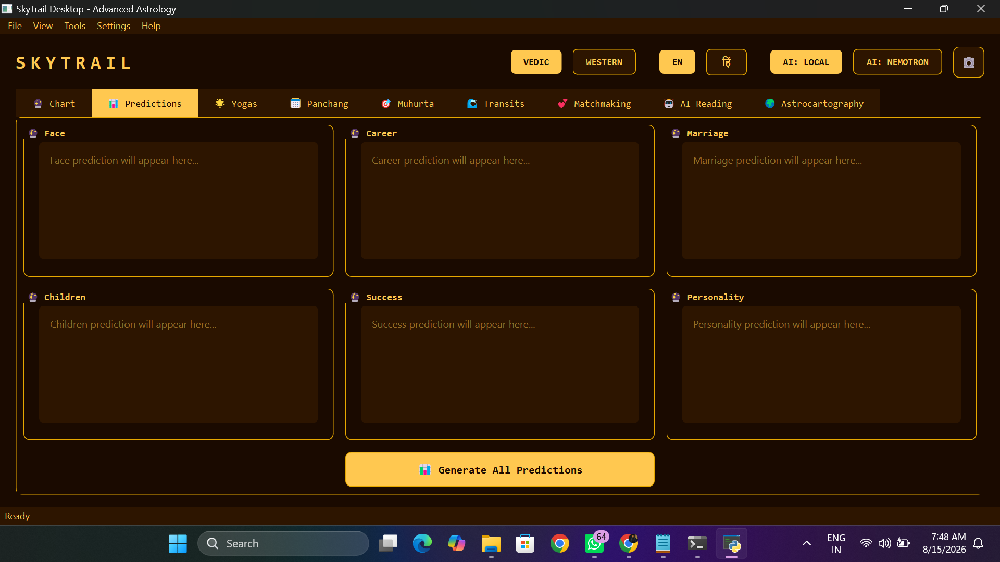
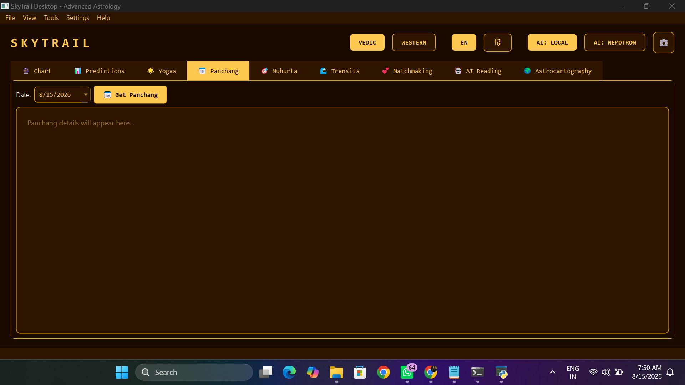
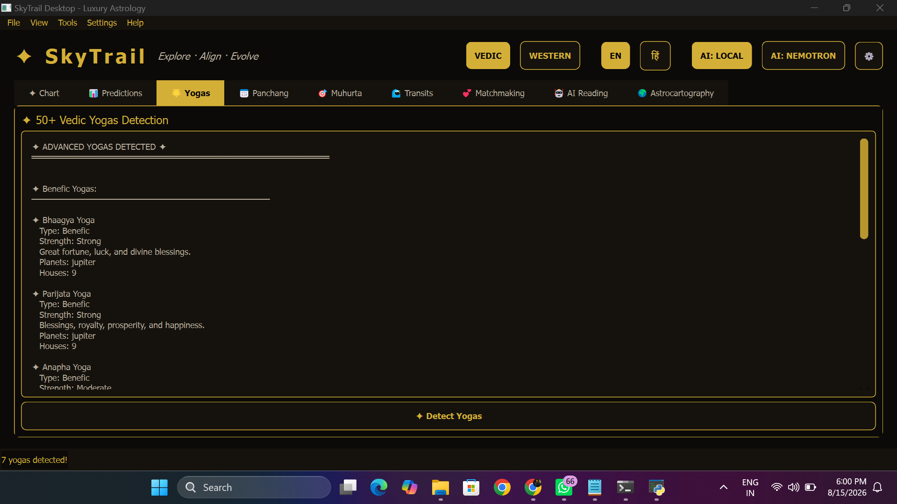
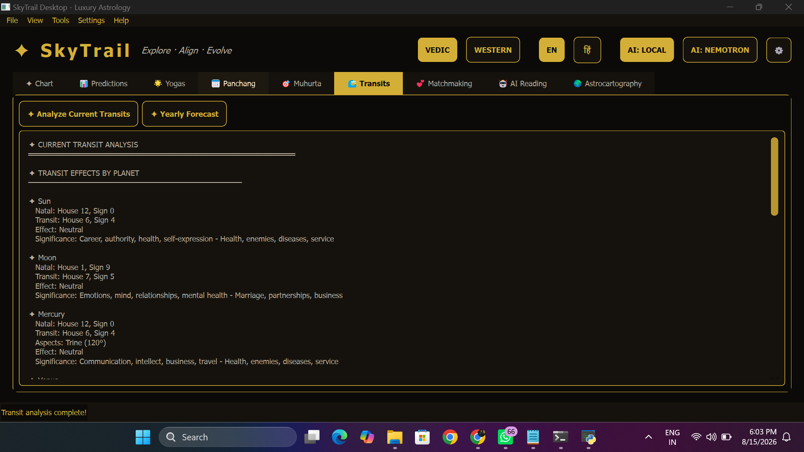
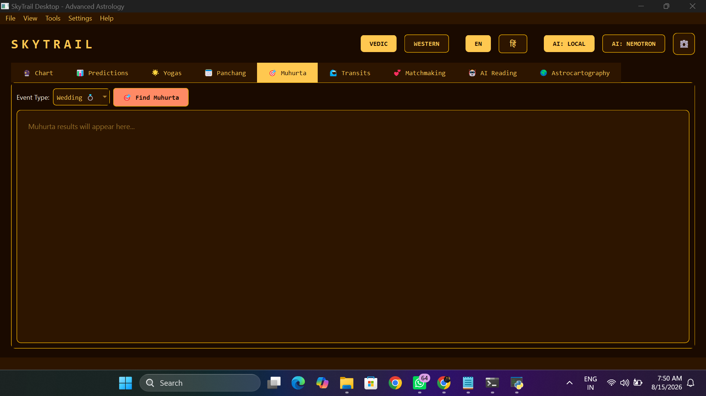
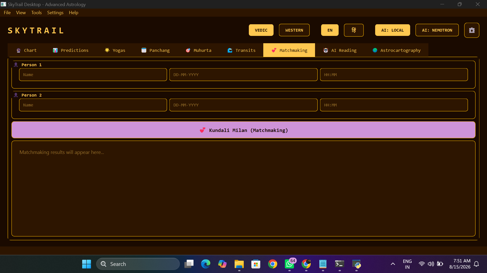
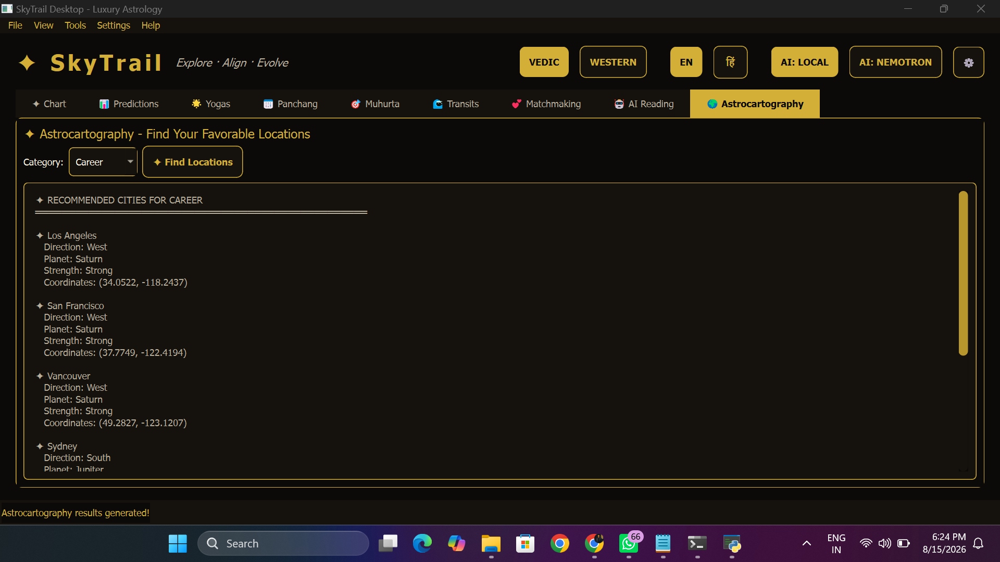
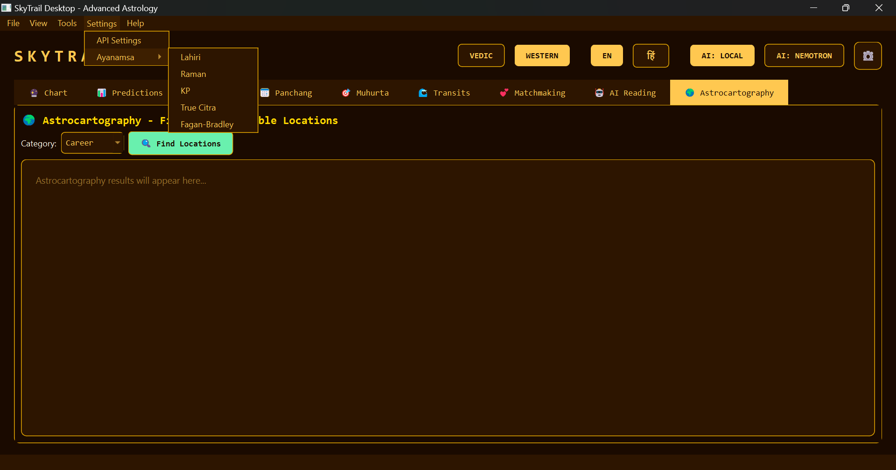
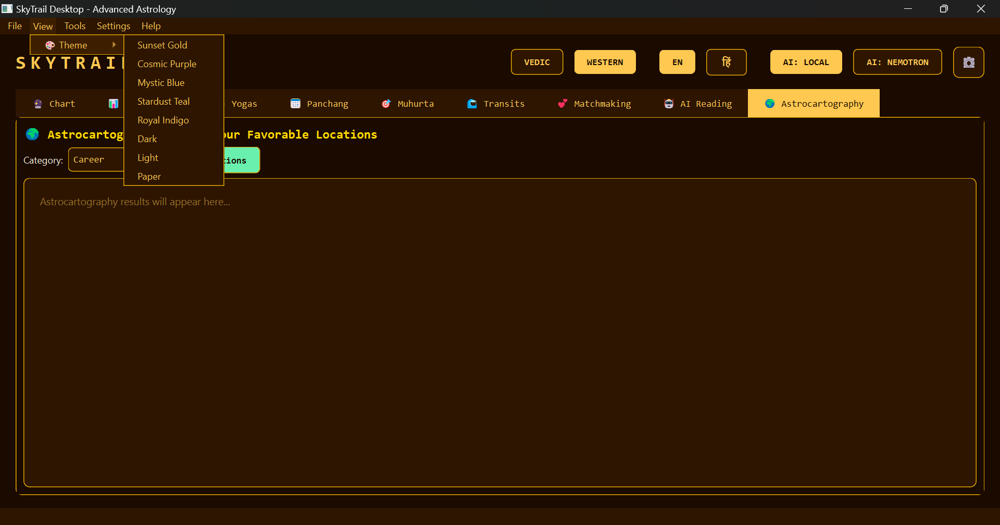

# SkyTrail Desktop

Vedic and Western Astrology desktop application with AI-powered readings, bilingual English/Hindi support, Panchang, Kundali matching, Astrocartography, planetary transits, Yogas and a holographic user interface.

## Developer

Ashwik Bire

LinkedIn: https://linkedin.com/in/ashwik-bire-b2a000186

Portfolio: https://ashwikbire.github.io/My-Portfolio/

GitHub: https://github.com/AshwikBire

Project Repository: https://github.com/AshwikBire/skytrail-desktop

## Screenshots

All screenshots below are loaded from the `Screenshots` folder in this repository.

### Main Interface


### AI Reading


### Predictions



### Panchang



### Yogas



### Transits



### Muhurta



### Matchmaking



### Astrocartography



### Ayanamsa



### Themes



### API Key Management


## Features

### Core Astrology

- Vedic astrology using sidereal calculations
- Western astrology using tropical calculations
- Multiple ayanamsa options
- Navamsa D9 chart
- Vimshottari Dasha system
- 50+ Vedic Yoga detection
- Planetary and house calculations

### Predictions

- Face reading
- Career prediction
- Marriage prediction
- Children prediction
- Success prediction
- Personality analysis

### Astrocartography

- Favorable locations
- Direction analysis
- Career and success locations
- Worldwide recommendations

### Panchang

- Tithi
- Vara
- Nakshatra
- Yoga
- Karana
- Sunrise and sunset
- Rahu Kaal
- Gulika Kaal
- Yamaganda

### Muhurta

- Wedding dates
- Business dates
- Travel dates
- Recommended upcoming dates

### Transits

- Current planetary transits
- House-based transit effects
- Daily and weekly analysis
- Yearly forecasts

### Kundali Matching

- 36-point Ashtakoot matching
- Varna
- Vashya
- Tara
- Yoni
- Graha Maitri
- Gana
- Bhakoot
- Nadi
- Compatibility analysis

### Yogas

- 50+ Vedic Yoga detection
- Raj Yogas
- Dhana Yogas
- Education Yogas
- Marriage Yogas
- Career Yogas
- Spiritual Yogas

### AI

- Local AI with Ollama
- qwen2.5:3b support
- Optional NVIDIA Nemotron cloud AI
- English and Hindi AI readings
- AI fallback support

### User Interface

- Holographic astrology interface
- Multiple visual themes
- English and Hindi interface
- PDF report export
- Screenshot capture
- API key management

## Technology Stack

| Technology | Purpose |
|---|---|
| Python 3.12 | Application development |
| PyQt6 | Desktop interface |
| Swiss Ephemeris | Astrology calculations |
| PyEphem | Ephemeris fallback |
| Ollama | Local AI |
| NVIDIA Nemotron | Optional cloud AI |
| ReportLab | PDF reports |

## Project Structure

```text
skytrail-desktop/
├── src/
├── Screenshots/
│   ├── AI Reading.png
│   ├── API Key Management.png
│   ├── Astrocartography.png
│   ├── Ayanmasa.png
│   ├── Main Interface.png
│   ├── Matchmaking.png
│   ├── Muhurta.png
│   ├── Panchang.png
│   ├── Predictions.png
│   ├── Themes.png
│   ├── Transits.png
│   └── Yogas.png
├── requirements.txt
├── run_skytrail.bat
├── README.md
├── LICENSE
└── .gitignore
```

## Installation

### Requirements

- Windows 10/11, macOS or Linux
- Python 3.12 or higher
- Ollama for local AI
- Optional NVIDIA Nemotron API key

### Setup

```bash
git clone https://github.com/AshwikBire/skytrail-desktop.git
cd skytrail-desktop
```

Create a virtual environment:

```bash
python -m venv venv
```

Windows:

```bash
venv\Scripts\activate
```

macOS/Linux:

```bash
source venv/bin/activate
```

Install dependencies:

```bash
pip install -r requirements.txt
```

For local AI:

```bash
ollama pull qwen2.5:3b
```

Run the application:

```bash
python src/main.py
```

On Windows, you can also use:

```bash
run_skytrail.bat
```

## AI Configuration

### Ollama

Install Ollama and download the supported model:

```bash
ollama pull qwen2.5:3b
```

The local AI option allows readings using a locally running model.

### NVIDIA Nemotron

Nemotron can be configured through the application's API settings when an internet connection and valid API key are available.

## Contributing

Contributions, improvements and bug reports are welcome.

1. Fork the repository.
2. Create a feature branch.
3. Make your changes.
4. Test the application.
5. Commit your changes.
6. Open a Pull Request.

## License

Distributed under the MIT License. See the `LICENSE` file for details.

## Disclaimer

SkyTrail Desktop is intended for educational and entertainment purposes.

Astrology readings should not be treated as professional medical, financial, legal or other professional advice. Important life decisions should be made using appropriate professional guidance.

## Contact and Links

LinkedIn: https://linkedin.com/in/ashwik-bire-b2a000186

Portfolio: https://ashwikbire.github.io/My-Portfolio/

GitHub: https://github.com/AshwikBire

SkyTrail Desktop: https://github.com/AshwikBire/skytrail-desktop
